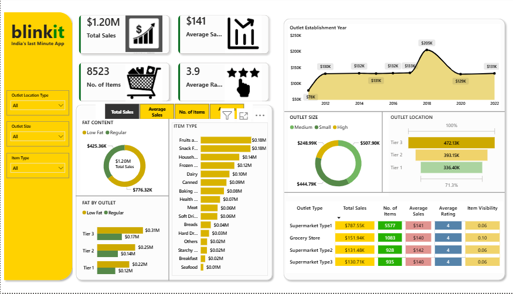

# Blinkit Sales Analysis Dashboard

## Project Overview
Interactive Power BI dashboard analyzing 8,523 sales records from 
Blinkit — India's last minute delivery app. The dashboard provides 
meaningful business insights across outlet types, product categories, 
fat content, and outlet locations from 2012 to 2022.

## Tools & Technologies
- **Visualization:** Power BI
- **Data Processing:** Power Query
- **Calculations:** DAX Measures
- **Data Source:** Blinkit Sales Dataset (Kaggle) — 8,523 records

## DAX Measures Created
- **Total Sales** — Overall revenue generated
- **Average Sales** — Average revenue per outlet
- **No. of Items** — Total items sold
- **Average Rating** — Customer satisfaction score
- **Additional Metrics** — Supporting business calculations

## Dashboard Features
- 4 KPI Cards: Total Sales, Average Sales, No. of Items, Average Rating
- Fat Content Analysis (Donut Chart)
- Item Type Performance (Bar Chart)
- Outlet Establishment Year Trend (Line Chart)
- Outlet Size Distribution (Donut Chart)
- Outlet Location Performance (Bar Chart)
- Outlet Type Summary Table
- Interactive slicers for Outlet Location Type, Outlet Size, Item Type

## Key Business Insights
- Total sales reached **$1.20M** across all outlets from 2012-2022
- **Fruits and Vegetables** is the top selling category at $180K — 
  indicating strong customer preference for healthy products
- **Low fat products** outsell regular fat products significantly — 
  suggesting health conscious buying behavior among customers
- **Supermarket Type 1** dominates revenue at $787.55K — 
  nearly 5x more than any other outlet type
- **Tier 3 locations** generate the highest sales at $472K — 
  suggesting strong demand in smaller cities
- Sales peaked in **2018 at $205K** before stabilizing

## Business Recommendations
- Focus marketing budget on Supermarket Type 1 outlets 
  as they generate highest revenue
- Expand low fat product range to meet growing health conscious demand
- Invest in Tier 3 location expansion given highest sales performance
- Investigate 2018 sales peak to replicate success factors

## Files
- `BlinkIt_data_analysis.pbix` — Power BI dashboard file

## Dashboard Preview

